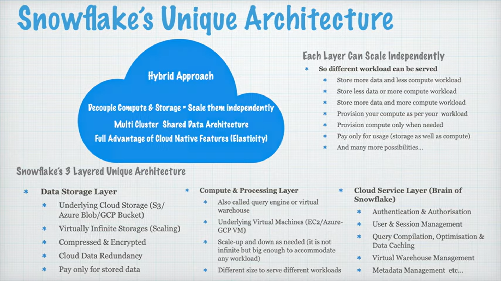
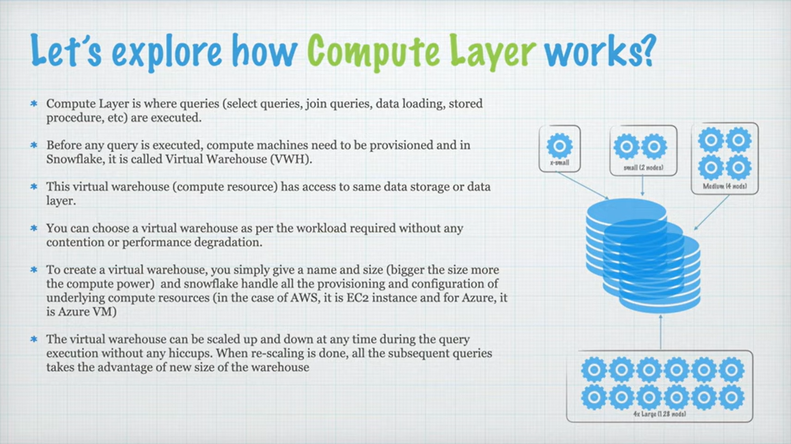
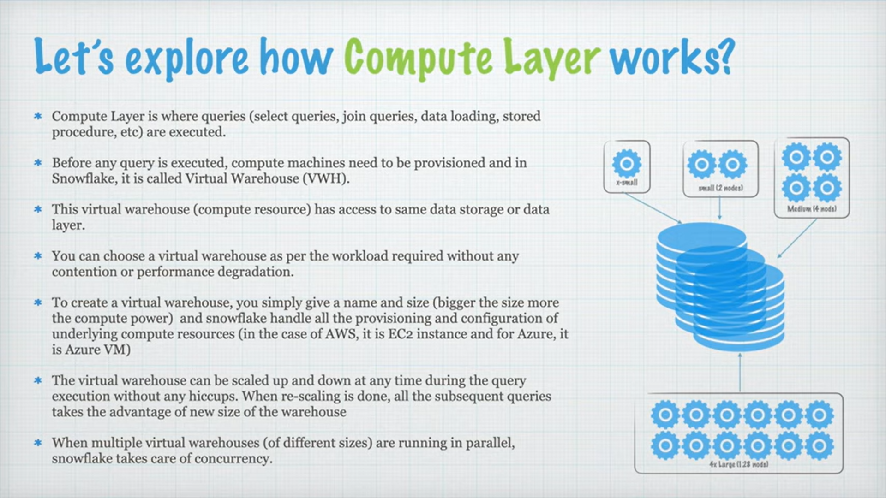

### snowflake interview question

#### What is snowflake

Snowflake is a cloud-native data platform and Software-as-a-Service (SaaS) that provides a data warehouse, data lake, and data engineering solution.

It is known for its unique architecture that separates storage and compute for independent scaling, performance, and cost-efficiency.

This enables secure data sharing and analytics across clouds:
- AWS
- Azure
- GCP

It is a fully managed service, allowing users to focus on data insights rather than infrastructure.

Snowflake supports workloads from BI to AI using:
- SQL
- Python
- Integrations with major data tools

#### Key Features & Architecture

- **Cloud-Native :** Built from the ground up for the cloud, running on major providers like AWS, Azure, and GCP.

- **Separation of Storage & Compute :** Scales storage and compute resources independently, optimizing performance and cost.

- **Virtual Warehouses :** Uses clusters of compute resources (virtual warehouses) for query processing, allowing on-demand scaling.

- **Data Sharing :** Enables secure, live data sharing and collaboration without data movement.

- **Multi-Workload Support :** Handles data warehousing, lakes, engineering, science, and app development on a single platform.

- **Managed Service (SaaS) :** Fully managed, so users don't manage infrastructure, maintenance, or upgrades. 

#### Benefits

- **Scalability & Performance :** Agility to scale up or down for varying data needs.

- **Cost-Effectiveness :** Pay-as-you-go model for usage, with separate billing for storage and compute.

- **Ease of Use :** Simplifies data management with a familiar SQL interface and support for various languages.

- **Security & Governance :** Built-in features for access control and encryption.

#### Use Cases

- Business Intelligence (BI) & Analytics

- Data Warehousing & Data Lakes

- Data Engineering & ETL/ELT

- Data Science & Machine Learning (ML)

- Data Sharing & Collaboration

 
